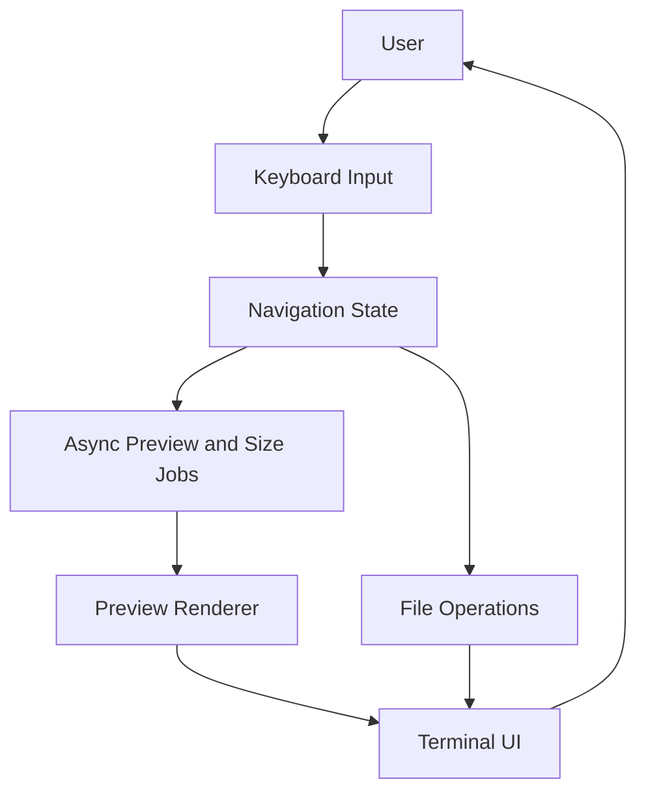

```text
╔══╦ ╦╔═╗╔═╗╔╗╔╔═╗╦═╗
╠══╚╦╝╔═╝║╣ ║║║║ ║╠╦╝
╩   ╩ ╚═╝╚═╝╝╚╝╚═╝╩╚═
```

<div align="center">


# Fyzenor

**A modern, blazing-fast terminal file manager built in C++ with live previews, async workflows, and a polished three-column interface.**

[](https://isocpp.org/)
[](https://invisible-island.net/ncurses/)
[](https://sw.kovidgoyal.net/kitty/graphics-protocol/)
[](#-quick-start)
[](#-cli-usage)

### Maintainer

<table>
  <tr>
    <td align="center" style="padding: 8px 18px;">
      <a href="https://github.com/Bimbok">
        
      </a>
      <br />
      <a href="https://github.com/Bimbok"><strong>@Bimbok</strong></a>
      <br />
      <sub>Author, Maintainer, and Lead Developer</sub>
    </td>
  </tr>
</table>

<sub>Fyzenor is designed and maintained by Bimbok.</sub>

</div>

---

## ⚡ Introduction

**Fyzenor** is a lightweight, high-performance terminal file manager engineered from the ground up with modern **C++17**. It is designed to bridge the gap between the raw power of the command line and the visual feedback of modern GUIs.

With its asynchronous architecture, Fyzenor ensures that heavy operations like directory size calculation and media preview generation never block the UI, providing a "blazing fast" experience even on large filesystems. Whether you are a developer, a system administrator, or a power user, Fyzenor allows you to navigate and manage your files with the speed of thought.

---

## 🖼️ Interface Preview

<div align="center">


<br /><br />

<br /><br />


</div>

---

## 🚀 Key Features

| Feature | Description |
| --- | --- |
| **Three-Column Layout** | Navigate with a Miller-style layout showing pinned items, parent/current directories, and a live preview pane. |
| **Async Media Preview** | Generate image and video previews in the background using the Kitty Graphics Protocol and `ffmpeg`, without freezing navigation. |
| **Modern & Polished UI** | A clean, minimal interface featuring rounded corners, optimized spacing, and an elegant color palette designed for long-term readability and comfort. |
| **Syntax-Aware Text Preview** | Preview code and text files with `bat` or `batcat`, with fallback to plain text when needed. |
| **Background Folder Sizing** | Directory sizes are calculated asynchronously and update in place while you keep moving. |
| **Vim-Style Navigation** | Fast keyboard-driven navigation with `h`, `j`, `k`, `l`, `g`, `G`, arrow keys, and enter-based traversal. |
| **Nerd Fonts Integration** | Rich iconography for directories, archives, media, and code file formats for faster visual identification. |
| **Multi-Selection & Bulk Actions** | Select multiple files and apply copy, cut, paste, delete, and zip operations efficiently. |
| **Persistent Pins** | Save frequently used directories to `~/.fm_pins` and jump back to them instantly. |
| **Flicker-Free Rendering** | Optimized redraw behavior keeps the interface smooth while reducing unnecessary terminal updates. |
| **Rich File Operations** | Create files/folders, rename entries, zip selections, copy absolute paths, and manage content without leaving the TUI. |
| **Theme Support** | Customize the UI through `~/.config/fyzenor/colors.fz`, with optional Matugen-powered wallpaper theming. |
| **Editor Integration** | Opens text/code files with your configured editor via `$EDITOR` or `$VISUAL`, with sensible fallbacks. |

---

## 🛠️ Tech Stack

### Core

- **Language:** C++17
- **UI Layer:** `ncursesw`
- **Concurrency:** C++ threads with mutex-protected async workflows
- **Filesystem:** `std::filesystem`

### External Tools

- **Preview Rendering:** Kitty Graphics Protocol
- **Image & Video Thumbnailing:** `ffmpeg`
- **Syntax Highlighting:** `bat` or `batcat`
- **Archive Support:** `zip`
- **Clipboard Support:** `xclip`, `wl-copy`, or `pbcopy`

---

## 🛠️ Prerequisites

To unleash the full power of Fyzenor, especially image previews, your system needs a few core components.

### 1. A Compatible Terminal

- **Recommended:** [Kitty](https://sw.kovidgoyal.net/kitty/) with native Kitty Graphics Protocol support.
- **Others:** [WezTerm](https://wezfurlong.org/wezterm/) or [Konsole](https://konsole.kde.org/) may work, but Kitty is the primary development and testing target.

### 2. System Dependencies

On Debian or Ubuntu based systems:

```bash
sudo apt update
sudo apt install build-essential libncursesw5-dev ffmpeg zip bat xclip wl-copy
```

- **`libncursesw`**: Essential for wide-character terminal rendering.
- **`ffmpeg`**: Powers asynchronous thumbnail generation for images and videos.
- **`zip`**: Required for built-in archive creation.
- **`bat` or `batcat`**: Used for syntax-highlighted text previews.
- **`xclip` / `wl-copy` / `pbcopy`**: Used for the copy-path feature.

---

## ⚙️ Installation & Update

The easiest way to install or update Fyzenor is using the universal installation script.

### One-Liner

```bash
curl -fsSL https://raw.githubusercontent.com/Bimbok/fyzenor/main/install.sh | bash
```

### Manual Installation & Updates

```bash
# 1. Clone the repository
git clone https://github.com/Bimbok/fyzenor.git

# 2. Enter the repository
cd fyzenor

# 3. Run the installer
./install.sh
```

The installer:

1. Compiles the C++ source into an optimized binary.
2. Installs `fyzenor` into `/usr/local/bin/`.
3. Creates an `fm` symlink for faster access.
4. Appends the `f` shell function to `.bashrc` or `.zshrc` for "jump to CWD on exit".

---

## 🚀 Quick Start

If you want to build and run Fyzenor manually instead of using the installer:

```bash
git clone https://github.com/Bimbok/fyzenor.git
cd fyzenor
g++ -std=c++17 -O3 file_manager.cpp -o fyzenor -lncursesw -lpthread
./fyzenor
```

This route is useful if you want direct control over compilation or want to test local modifications before installation.

---

## 🎨 Customization & Theming

Fyzenor supports custom themes via `~/.config/fyzenor/colors.fz`. The default theme is **Catppuccin Mocha**.

### Configuration Format

Create `~/.config/fyzenor/colors.fz` and define colors using hex codes:

```text
DIR: #89b4fa
FILE: #cdd6f4
SEL_BG: #585b70
MEDIA: #f9e2af
IMAGE: #f5c2e7
BORDER: #b4befe
SUCCESS: #a6e3a1
ERROR: #f38ba8
MULTI: #fab387
PIN_BG: #cba6f7
PIN_BORDER: #89b4fa
SEC_SEL_BG: #313244
CODE: #a6e3a1
ARCHIVE: #eba0ac
```

### Wallpaper-Based Theming (Matugen)

Instead of manually writing colors, you can use **Matugen** to generate a theme that matches your current wallpaper.

#### Step 1: Create the Matugen Template

Create `~/.config/matugen/templates/fyzenor-colors.template`:

```text
# Fyzenor Theme: Matugen Generated
DIR: {{colors.primary.default.hex}}
FILE: {{colors.on_surface.default.hex}}
SEL_BG: {{colors.surface_variant.default.hex}}
MEDIA: {{colors.tertiary.default.hex}}
IMAGE: {{colors.secondary.default.hex}}
BORDER: {{colors.outline.default.hex}}
SUCCESS: {{colors.primary_fixed.default.hex}}
ERROR: {{colors.error.default.hex}}
MULTI: {{colors.tertiary_container.default.hex}}
PIN_BG: {{colors.secondary_container.default.hex}}
PIN_BORDER: {{colors.primary.default.hex}}
SEC_SEL_BG: {{colors.surface_dim.default.hex}}
```

#### Step 2: Update your Matugen Config

Add this block to your `~/.config/matugen/config.toml`:

```toml
[templates.fyzenor]
input_path = "~/.config/matugen/templates/fyzenor-colors.template"
output_path = "~/.config/fyzenor/colors.fz"
```

#### Step 3: Generate the Colors

```bash
matugen image /path/to/your/wallpaper.jpg
```

---

## 🛠️ CLI Usage

Fyzenor supports the following command-line arguments:

| Option | Description |
| :--- | :--- |
| `-v`, `--version` | Display the current version of Fyzenor. |
| `-h`, `--help` | Show the help message and exit. |
| `--cwd-file <file>` | Write the final working directory to `<file>` on exit. |

```bash
fyzenor --version
```

---

## 🏗️ Architecture

Fyzenor is structured as a compact terminal application with asynchronous jobs handling the expensive operations that would otherwise block UI updates.

```text
fyzenor/
├── file_manager.cpp   # Core application logic, UI rendering, preview pipeline
├── install.sh         # Installer and shell integration bootstrap
├── fyzenor.png        # Branding asset used in the README
└── Sample/            # Showcase screenshots
```

### How It Works

1. **Navigation State:** Tracks the current directory, parent context, selected entry, pins, and multi-selection state.
2. **Async Preview Pipeline:** Generates media previews and text previews without freezing the navigation loop.
3. **Background Size Calculation:** Directory sizes are resolved in the background and merged back into the UI.
4. **Command Handling:** Keybindings trigger file operations, pin management, sorting, preview refresh, and shell integration behavior.

### System Flow



---

## 🔌 Shell Integration (Jump to CWD on exit)

Fyzenor can change your shell's current working directory upon exit. If you use the installer, this is handled automatically for `.bashrc` and `.zshrc`.

Otherwise, add this function to your shell configuration:

```bash
function f() {
	local tmp="$(mktemp -t "fyzenor-cwd.XXXXXX")" cwd
	fyzenor "$@" --cwd-file="$tmp"
	if [ -f "$tmp" ]; then
		cwd=$(cat "$tmp")
		rm -f -- "$tmp"
		if [ -n "$cwd" ] && [ "$cwd" != "$PWD" ]; then
			builtin cd -- "$cwd"
		fi
	fi
}
```

Now run `f` instead of `fyzenor` to jump to the last visited directory after exit.

---

## ⌨️ Controls

### Navigation

| Key | Action |
| :--- | :--- |
| `k` or `↑` | Move selection up |
| `j` or `↓` | Move selection down |
| `h` or `←` or `BS` | Go to parent directory |
| `l` or `→` or `Enter` | **Open file** / Enter directory |
| `g` | Go to top of list |
| `G` | Go to bottom of list |

> **Note on Opening Files:** Fyzenor automatically detects text and code files and opens them using your terminal-based editor, respecting `$EDITOR`, `$VISUAL`, `nvim`, `nano`, then `vi`. Media files are opened with `mpv` if available, and other files use your system's default opener.

### File Operations

| Key | Action |
| :--- | :--- |
| `y` | **Yank** (Copy) selected items to internal clipboard |
| `x` | **Cut** selected items |
| `p` | **Paste** items from clipboard |
| `d` or `Delete` | **Delete** selected items with confirmation |
| `r` | **Rename** current item |
| `n` | Create **New File** |
| `N` | Create **New Folder** |
| `z` | **Zip** selected items into an archive |
| `c` | **Copy Absolute Path** to system clipboard |

### Selection, View & Pins

| Key | Action |
| :--- | :--- |
| `Space` or `v` | Toggle selection of current file |
| `a` | Select **All** files in current directory |
| `Esc` | **Clear** all active selections |
| `.` | Toggle hidden files |
| `s` | Toggle sorting by **Size** vs Name |
| `P` | Pin current directory |
| `Tab` | Toggle focus between **Files** and **Pins** |
| `q` | Quit Fyzenor |

### Pin Mode Controls

- `j` / `k` or `↑` / `↓`: Navigate through your pins.
- `Enter` / `l` / `→`: Instantly jump to the pinned directory.
- `d` / `Delete`: Remove the selected pin.
- `Tab`: Switch focus back to the main file browser.

---

## 🎨 Visuals & Protocols

### Kitty Graphics Protocol

Fyzenor uses the [Kitty Graphics Protocol](https://sw.kovidgoyal.net/kitty/graphics-protocol/) for high-resolution image and video previews. Previews are generated asynchronously so the UI remains fluid during navigation.

### Nerd Fonts

Icons are rendered using [Nerd Fonts](https://www.nerdfonts.com/). Ensure your terminal is using a Nerd Font for icons to display correctly.

### Syntax Highlighting

Text previews use `bat` or `batcat` when available. If neither is installed, Fyzenor falls back to plain text preview. Binary files are detected and skipped to prevent terminal corruption.

---

## 🤝 Contributing

Contributions are welcome.

1. Fork the repository.
2. Create a feature branch.
3. Make your changes.
4. Test locally.
5. Open a pull request with a clear description.

For detailed contribution workflow, see [CONTRIBUTING.md](CONTRIBUTING.md).
Community participation is governed by [CODE_OF_CONDUCT.md](CODE_OF_CONDUCT.md).

---

## 📞 Contact

- **GitHub:** [Bimbok](https://github.com/Bimbok)
- **Issues:** [Open an issue](https://github.com/Bimbok/fyzenor/issues)

---

## ⚖️ License

Distributed under the MIT License. See `LICENSE` for more information.
